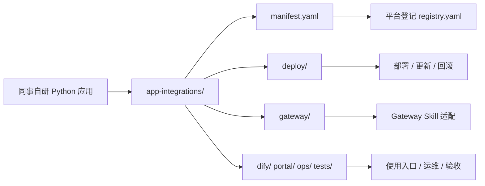

# Python 应用场景自维护目录设计建议

更新时间：2026-04-29

## 1. 背景

同事按统一接口标准开发 Python 应用后，后续还会持续更新功能、依赖、部署参数、Dify 编排、Portal 入口和运维说明。

如果所有信息只保存在个人电脑、聊天记录或单独项目里，平台会遇到几个问题：

- 不知道当前生产环境跑的是哪个版本
- 不知道某个功能由谁维护
- 不知道更新时是否影响 Gateway、Dify、Portal、OneDrive 交付
- 出问题时难以回滚
- 新同事接手成本高

因此建议建立统一目录：

[app-integrations](/Users/yangpu/ai-platform/app-integrations)

这个目录作为所有 Python 应用场景进入 AI 平台的“接入档案”和“维护入口”。

## 2. 总体设计



建议把 `app-integrations/` 定位为：

- 平台集成资料库
- 同事自维护入口
- 平台发布评审依据
- 版本、部署、权限、交付、运维的统一台账

## 3. 目录结构

```text
app-integrations/
  README.zh-CN.md
  registry.yaml
  templates/
  <app_id>/
    manifest.yaml
    README.zh-CN.md
    api/
      openapi.json
      sample-request.json
      sample-response.json
    deploy/
      docker-compose.yml
      .env.example
      volumes.md
    gateway/
      skill.json
      adapter.md
    dify/
      workflow-notes.md
    portal/
      ui-spec.md
    ops/
      RUNBOOK.zh-CN.md
      CHANGELOG.md
    tests/
      check_health.sh
      check_run.sh
```

### 为什么不只放一个 README

因为一个应用进入平台后，至少会影响五类人：

- 开发同事：关心代码、依赖、接口、参数
- 平台维护者：关心 Gateway、权限、统计、交付
- 业务使用者：关心入口、输入、输出和限制
- 运维人员：关心启动、日志、故障和回滚
- 管理员：关心负责人、状态、风险和调用量

固定目录可以让每类信息都有稳定位置。

## 4. 每个文件的职责

### `manifest.yaml`

这是最重要的文件，是应用接入 AI 平台的身份证。

它回答：

- 这是什么应用
- 谁负责
- 当前状态是什么
- 服务端口和健康检查地址是什么
- 是否支持文件
- 是否会调用外部 API
- 是否会把公司数据发给第三方
- 对应哪个 `skill_id`
- 是否需要 Portal、Dify、OpenClaw 入口

平台可以后续基于 `manifest.yaml` 自动生成后台登记、健康检查和发布清单。

### `README.zh-CN.md`

给人看的业务说明。

它回答：

- 这个功能解决什么问题
- 哪些同事适合使用
- 输入输出是什么
- 有什么限制
- 如何联系负责人

### `api/`

放接口样例和协议。

建议至少有：

- `sample-request.json`
- `sample-response.json`
- `openapi.json`，如有

### `deploy/`

放部署文件。

建议至少有：

- `docker-compose.yml`
- `.env.example`
- `volumes.md`

注意：`.env.example` 只能写占位值，不能写真实密钥。

### `gateway/`

放平台接入说明。

建议至少有：

- `skill.json`：Skill 注册建议
- `adapter.md`：Gateway 如何调用、如何映射字段、如何处理错误

### `dify/`

如果该能力要进入 Dify 工作流，在这里写：

- Dify HTTP 节点如何调用 Gateway
- 输入字段
- 输出字段
- 是否需要人工确认

### `portal/`

如果该能力要进入门户，在这里写：

- 放在哪个模块
- 用户输入字段
- 页面展示方式
- 是否自动交付

### `ops/`

放运维资料。

建议至少有：

- `RUNBOOK.zh-CN.md`
- `CHANGELOG.md`

### `tests/`

放最小联调脚本。

建议至少有：

- `check_health.sh`
- `check_run.sh`

## 5. 状态流转

建议应用状态统一使用：

```text
draft -> integrating -> trial -> active -> paused -> retired
```

含义：

- `draft`：同事开发中，未进入平台联调
- `integrating`：平台正在接入 Gateway、权限和交付
- `trial`：小范围试运行
- `active`：正式可用
- `paused`：临时暂停调用
- `retired`：已下线，仅保留历史记录

状态写在两个地方：

- `app-integrations/registry.yaml`
- `<app_id>/manifest.yaml`

## 6. 版本规则

建议使用语义化版本：

```text
MAJOR.MINOR.PATCH
```

示例：

- `0.1.0`：初始试运行版本
- `0.2.0`：新增功能或输出字段
- `0.2.1`：修复 bug，不改变接口
- `1.0.0`：正式稳定版本
- `2.0.0`：接口不兼容升级

### 什么情况必须升版本

- 改了 `/v1/run` 请求字段
- 改了响应结构
- 改了输出文件格式
- 改了模型、第三方 API 或关键算法
- 改了 Docker 端口或环境变量
- 改了数据是否出本地的安全属性

### 什么情况只写 Changelog

- 修复提示词
- 调整日志
- 增加测试样例
- 更新说明文档
- 修复部署命令

## 7. 更新流程

同事更新功能时，建议按这个顺序：

1. 修改应用代码或独立仓库。
2. 更新 `<app_id>/manifest.yaml` 的版本、接口、环境变量或安全说明。
3. 更新 `deploy/` 中的部署文件。
4. 更新 `api/` 中的请求/响应样例。
5. 更新 `gateway/adapter.md`，说明是否影响 Gateway。
6. 更新 `ops/CHANGELOG.md`。
7. 跑 `tests/check_health.sh` 和 `tests/check_run.sh`。
8. 通知平台维护者评审。
9. 平台维护者更新 Gateway / Portal / Dify 配置。
10. 小范围验证后再切到正式。

## 8. 平台维护者评审清单

平台维护者收到同事更新后，至少检查：

- `manifest.yaml` 是否完整
- 状态和版本是否合理
- 是否新增真实密钥或敏感文件
- Docker 端口是否冲突
- 环境变量是否有 `.env.example`
- 输出文件是否写到 `/data/deliveries/apps`
- 是否改变 Skill 权限范围
- 是否影响 Portal / Dify / OpenClaw
- 是否需要数据库迁移
- 是否需要重启 Gateway
- 是否有可回滚版本

## 9. 推荐落地方式

### 第一阶段：先统一资料目录

所有正在开发或准备接入的功能，都先在 `app-integrations/` 建目录。

即使代码还没接入，也先有：

- `manifest.yaml`
- `README.zh-CN.md`
- `deploy/.env.example`
- `api/sample-request.json`
- `api/sample-response.json`

### 第二阶段：统一部署方式

优先使用 Docker Compose。

对机器学习重依赖、Apple Silicon 加速、本机驱动依赖较重的服务，可以先用本机 `launchd`，但仍要在 `deploy/` 中写清楚启动、停止和检查方式。

### 第三阶段：统一 Gateway 适配

平台侧把成熟功能注册为 Skill，接入：

- 权限
- 审计
- 调用量统计
- OneDrive 交付
- Portal/Dify/OpenClaw 入口

### 第四阶段：统一后台治理

后续可以让后台管理页读取 `registry.yaml` 或数据库，显示：

- 应用列表
- 负责人
- 健康状态
- 版本
- 最近调用量
- 失败率
- 是否可交付
- 是否对外部 API 传输数据

## 10. 建议新增功能时的命令

示例：新增合同审查功能。

```bash
cd /Users/yangpu/ai-platform
cp -R app-integrations/templates app-integrations/contract-review
```

然后修改：

```text
app-integrations/contract-review/manifest.yaml
app-integrations/contract-review/README.zh-CN.md
app-integrations/contract-review/deploy/docker-compose.yml
app-integrations/contract-review/deploy/.env.example
app-integrations/contract-review/gateway/skill.json
app-integrations/registry.yaml
```

## 11. 权限与所有权建议

每个应用必须有一个业务负责人和一个技术负责人。

如果同一个人兼任，也要写清楚。

建议字段：

```yaml
owner:
  user_id: mike.xiang
  name: 向阳
  email: mike.xiang@yprenewables.com
maintainers:
  - user_id: colleague.user
    name: 同事姓名
    email: colleague.user@yprenewables.com
```

负责人职责：

- 确认业务输出质量
- 确认是否可全员开放
- 确认是否涉及第三方数据传输
- 协助处理用户反馈
- 更新版本和 Changelog

## 12. 不建议的做法

不建议：

- 每个功能自己开一个完全不同的部署目录
- 只给平台一个 Python 文件，没有 README 和部署说明
- 功能直接写入 OneDrive 用户目录
- 功能直接访问 Gateway 数据库
- 功能直接让 Dify 暴露真实第三方 API Key
- 代码里写死用户 ID、文件路径、Token
- 接口返回结构每次升级都不兼容
- 没有负责人和回滚方案就上线

## 13. 已创建的模板

当前已创建：

- [app-integrations/README.zh-CN.md](/Users/yangpu/ai-platform/app-integrations/README.zh-CN.md)
- [app-integrations/registry.yaml](/Users/yangpu/ai-platform/app-integrations/registry.yaml)
- [app-integrations/templates](/Users/yangpu/ai-platform/app-integrations/templates)

后续同事只需要复制 `templates/`，按自己的 `app_id` 改名并填空即可。

