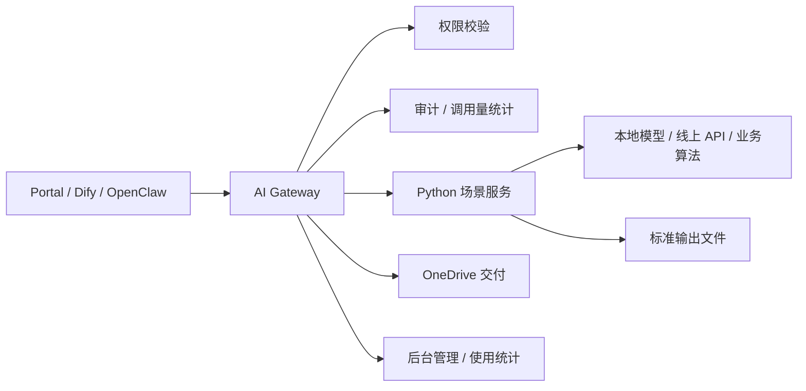

# Python 应用场景接入 AI 平台集成流程与标准

更新时间：2026-04-29

## 1. 目标

本文档面向正在开发 Python 应用场景的同事，规定应用如何接入公司内部 AI 平台。

接入目标不是“把脚本跑起来”这么简单，而是统一做到：

- 能被门户、Dify、OpenClaw 和后续自动化流程调用
- 能纳入用户权限、调用量统计、审计日志和排名统计
- 能把生成物交付到 OneDrive 用户目录
- 能被运维检查、复现、回滚和持续升级
- 不把密钥、敏感文件和个人目录路径散落在各应用里

## 2. 总体原则

1. 所有业务能力优先接入 `AI Gateway`，不要让门户、Dify 或 OpenClaw 直接调用各自的 Python 脚本。
2. Python 应用应该封装成“能力服务”，对外提供标准 HTTP 接口；Gateway 负责鉴权、审计、统计和交付。
3. Dify 主要负责流程编排和低代码交互，不建议把核心业务逻辑只写在 Dify 节点里。
4. OpenClaw 主要负责微信/会话入口和意图识别，不建议承载长任务和文件处理。
5. 生成文件统一写入平台约定目录，再由 Gateway 分发到 OneDrive，不建议应用自己操作 OneDrive。
6. 模型 Key、第三方 API Key、数据库密码只能走环境变量或平台密钥配置，不允许写进代码、文档或示例请求。
7. 应用必须有最小可运行测试样例、健康检查接口和错误码说明，否则不进入试运行。

## 3. 推荐接入架构



### 分层职责

- `Portal`：面向同事使用的交互界面，例如快捷能力、文档任务、交付中心。
- `Dify`：适合做多步骤流程编排、表单化输入、知识库问答链路。
- `OpenClaw`：适合微信入口、自然语言路由和轻量对话。
- `AI Gateway`：统一入口，负责用户、权限、技能注册、审计、统计、交付和适配调用。
- `Python 场景服务`：只负责具体业务能力，例如报价单解析、合同审查、图片处理、Excel 分析、报告生成。

## 4. 接入方式分级

### A 类：HTTP 微服务接入，推荐

适用于大多数 Python 应用场景。

要求：

- 使用 `FastAPI` 或同等框架
- 提供 `/health`
- 提供同步或异步标准接口
- 支持 JSON 输入输出
- 文件输出写入平台约定目录
- 可通过 Docker Compose 或本机 `launchd` 常驻

适合：

- 合同审查
- Excel 分析
- 报告生成
- 图片/音频/视频处理
- 需要第三方 API 的独立能力
- 运行时间超过 10 秒的任务

### B 类：Gateway 内置适配

适用于已经非常稳定、代码量较小、依赖简单的能力。

要求：

- 由平台维护者把能力封装进 Gateway 或 `workflow_runner`
- 保持与 Gateway 进程同生命周期
- 不引入大模型包、重型系统依赖或长时间阻塞逻辑

适合：

- Prompt 模板类快捷能力
- Markdown 转 Word
- 轻量文件交付
- 简单文本转换

### C 类：Dify 工具或工作流接入

适用于业务同事希望拖拽编排、表单输入、调用多个节点的场景。

要求：

- Dify 调用 Gateway 暴露的标准接口
- 不建议 Dify 直接访问业务数据库、OneDrive 或第三方密钥
- Dify 工作流必须有输入输出字段说明

适合：

- 多步骤审批前草稿
- 知识库问答 + 文档生成
- 人工确认后再执行的流程

### D 类：命令行包装接入，临时过渡

适用于已有 Python 脚本短期无法改成服务的情况。

要求：

- 命令必须支持非交互运行
- 输入输出必须可落盘
- stdout 输出标准 JSON
- stderr 输出日志
- 需在后续版本升级为 HTTP 微服务

适合：

- 原型验证
- 算法同事已有 CLI 工具
- 离线批处理

## 5. Python 服务接口标准

### 5.1 健康检查

每个服务必须提供：

```http
GET /health
```

返回示例：

```json
{
  "status": "ok",
  "service": "contract-review",
  "version": "0.1.0",
  "time": "2026-04-29T10:00:00+08:00"
}
```

最低要求：

- `status=ok` 表示服务可接收请求
- 如果依赖模型、第三方 API、数据库或本地目录，也应在 `dependencies` 中说明

### 5.2 同步执行接口

适用于 30 秒以内可完成的任务。

```http
POST /v1/run
Content-Type: application/json
```

请求标准：

```json
{
  "request_id": "req_xxx",
  "user_id": "mike.xiang",
  "skill_id": "contract_review",
  "input": {
    "text": "待处理文本",
    "files": [
      {
        "path": "/data/uploads/example.pdf",
        "filename": "example.pdf",
        "mime_type": "application/pdf"
      }
    ],
    "params": {
      "language": "zh",
      "output_format": "markdown_docx"
    }
  },
  "context": {
    "source": "portal",
    "timezone": "Asia/Shanghai",
    "trace_id": "trace_xxx"
  },
  "delivery": {
    "auto_deliver": true,
    "title": "合同审查结果",
    "formats": ["md", "docx"]
  }
}
```

响应标准：

```json
{
  "ok": true,
  "status": "success",
  "request_id": "req_xxx",
  "provider": "contract-review-service",
  "model": "rule-v1+qwen3.5",
  "content": "# 合同审查结果\n\n...",
  "data": {
    "risk_count": 3,
    "summary": "发现 3 个待确认风险点"
  },
  "files": [
    {
      "path": "/data/deliveries/apps/contract_review/mike.xiang/2026-04-29/result.md",
      "filename": "result.md",
      "mime_type": "text/markdown"
    }
  ],
  "metrics": {
    "duration_ms": 12800,
    "input_chars": 3200,
    "output_chars": 1800
  }
}
```

### 5.3 异步任务接口

运行超过 30 秒、需要排队、需要处理大文件的能力，必须使用异步模式。

创建任务：

```http
POST /v1/jobs
```

返回：

```json
{
  "ok": true,
  "status": "accepted",
  "request_id": "req_xxx",
  "job_id": "job_xxx",
  "poll_url": "/v1/jobs/job_xxx"
}
```

查询任务：

```http
GET /v1/jobs/{job_id}
```

处理中返回：

```json
{
  "ok": true,
  "status": "running",
  "job_id": "job_xxx",
  "progress": {
    "percent": 45,
    "stage": "extracting"
  }
}
```

完成返回：

```json
{
  "ok": true,
  "status": "success",
  "job_id": "job_xxx",
  "content": "处理完成摘要",
  "files": [
    {
      "path": "/data/deliveries/apps/excel_analysis/mike.xiang/2026-04-29/report.xlsx",
      "filename": "report.xlsx",
      "mime_type": "application/vnd.openxmlformats-officedocument.spreadsheetml.sheet"
    }
  ]
}
```

失败返回：

```json
{
  "ok": false,
  "status": "failed",
  "job_id": "job_xxx",
  "error": {
    "code": "input_file_not_supported",
    "message": "当前仅支持 xlsx/csv 文件",
    "retryable": false
  }
}
```

## 6. 错误码标准

错误响应必须统一：

```json
{
  "ok": false,
  "status": "failed",
  "request_id": "req_xxx",
  "error": {
    "code": "invalid_input",
    "message": "缺少 input.text 或 input.files",
    "retryable": false,
    "detail": {}
  }
}
```

推荐错误码：

- `invalid_input`：输入参数错误
- `file_not_found`：文件不存在
- `file_too_large`：文件超过限制
- `file_type_not_supported`：文件类型不支持
- `permission_denied`：业务侧二次权限不通过
- `upstream_timeout`：模型或第三方 API 超时
- `upstream_error`：模型或第三方 API 返回错误
- `quota_exceeded`：调用额度不足
- `internal_error`：未分类服务端错误

## 7. 文件输入输出标准

### 7.1 输入文件

推荐由 Gateway 或文档中心负责上传、登记和路径白名单校验。

Python 服务收到的文件路径应该是平台内部路径，例如：

```text
/data/uploads/...
/data/document-intelligence/...
/data/deliveries/...
```

不建议服务直接读取：

```text
/Users/<个人用户名>/Desktop/...
/Users/<个人用户名>/Downloads/...
/Volumes/<移动硬盘>/...
```

如果确实需要处理本机移动硬盘或历史 4T 资料，应先由文档智能登记流程接管，再把平台路径传给服务。

### 7.2 输出文件

应用输出文件统一写入：

```text
/data/deliveries/apps/<app_id>/<user_id>/<yyyy-mm-dd>/<request_id>/
```

建议同时输出：

- `result.md`：可读 Markdown
- `result.json`：结构化结果
- `result.docx`：面向交付的 Word 文件，如适用
- `result.xlsx`：面向数据分析的 Excel 文件，如适用
- `manifest.json`：输出清单

`manifest.json` 示例：

```json
{
  "app_id": "contract_review",
  "request_id": "req_xxx",
  "user_id": "mike.xiang",
  "title": "合同审查结果",
  "created_at": "2026-04-29T10:00:00+08:00",
  "files": [
    {
      "path": "/data/deliveries/apps/contract_review/mike.xiang/2026-04-29/req_xxx/result.docx",
      "filename": "result.docx",
      "mime_type": "application/vnd.openxmlformats-officedocument.wordprocessingml.document"
    }
  ]
}
```

### 7.3 OneDrive 交付

应用只返回文件路径，由 Gateway 调用统一交付模块分发到：

```text
Yangpu - AI Center/<user_id>/<yyyy>/<yyyy-mm-dd>/<time-request-skill>/
```

应用不得自己创建同事 OneDrive 目录，不得自己判断用户目录权限。

## 8. Skill 注册标准

每个应用场景需要注册为一个平台 Skill。

### 8.1 命名规范

`skill_id` 使用小写英文、数字、下划线或短横线。

推荐格式：

```text
<domain>_<capability>[_version]
```

示例：

- `contract_review`
- `quote_extract`
- `excel_sales_analysis`
- `meeting_minutes_asr`
- `image_background_remove`

不要使用：

- 中文 skill_id
- 个人姓名作为 skill_id
- 不可读缩写
- 带空格的 ID

### 8.2 Skill 元数据

注册时至少包含：

- `skill_id`
- `name`
- `description`
- `owner_id`
- `backend_type`
- `scope`
- `status`
- `config`

示例：

```json
{
  "skill_id": "contract_review",
  "name": "合同审查",
  "description": "识别合同关键条款、风险点和待确认事项",
  "owner_id": "mike.xiang",
  "backend_type": "python_service",
  "scope": "company",
  "status": "active",
  "config": {
    "endpoint": "http://contract-review:8101/v1/run",
    "health_url": "http://contract-review:8101/health",
    "mode": "sync",
    "timeout_seconds": 300,
    "supports_files": true,
    "default_delivery": true
  }
}
```

### 8.3 权限

上线前必须明确：

- 哪些用户可以用
- 是否所有同事可用
- 是否仅管理员可用
- 是否涉及敏感数据或外部 API

权限通过平台表维护：

- `user_skill_permissions`
- `user_default_skills`

不要在 Python 服务里写死用户白名单。服务可以做业务二次校验，但平台权限必须先过 Gateway。

## 9. Gateway 适配标准

每个 Python 服务接入 Gateway 时，应由平台维护者增加一个适配层。

适配层负责：

- 读取 Skill 配置
- 校验用户权限
- 生成 `request_id`
- 传递标准请求给 Python 服务
- 处理同步/异步返回
- 写入 `conversations / messages / audit_logs`
- 收集 `metrics`
- 调用 OneDrive 交付
- 把结果返回给 Portal/Dify/OpenClaw

Python 服务不直接写平台审计表，除非经过平台维护者确认。

## 10. Portal 集成标准

如果能力要出现在门户中，需要提供：

- 能力名称
- 一句话说明
- 输入字段
- 输出字段
- 是否支持上传文件
- 是否自动交付
- 是否需要管理员权限
- 典型示例

建议页面形态：

- 高频能力进入“快捷能力工作台”
- 文件类能力进入“文档任务中心”
- 管理类能力进入“后台管理”
- 长任务进入任务列表，显示状态和结果入口

## 11. Dify 集成标准

Dify 调用平台能力时，推荐只调用 Gateway。

标准方式：

```text
Dify HTTP 节点 -> AI Gateway -> Python 服务 -> Gateway 交付/统计
```

Dify HTTP 节点请求中至少传：

- `user_id`
- `skill_id`
- `input`
- `delivery`

Dify 不建议直接传第三方 API Key，不建议直接访问 OneDrive 本地目录。

## 12. OpenClaw / 微信集成标准

如果能力要给微信入口使用，需要提供：

- 触发意图说明
- 适合和不适合调用的场景
- 用户缺少参数时的追问问题
- 结果是否需要文件回传
- 是否允许长任务

OpenClaw 侧只负责判断是否调用：

```text
[[CALL_DB_SKILL:<skill_id>]]
```

真正执行仍由 Gateway 完成。

## 13. 安全与合规要求

### 必须做到

- 不在代码中硬编码 API Key、Token、密码
- 不在日志中打印完整密钥、身份证、手机号、合同全文等敏感信息
- 第三方 API 调用必须在文档中说明数据会离开本地
- 文件路径必须做白名单或平台路径约束
- 输出文件必须按用户目录隔离
- 错误信息不要泄露内部堆栈给普通用户

### 建议做到

- 对大文件设置大小限制
- 对外部 API 设置超时和重试上限
- 对模型调用记录 provider、model、耗时
- 对高风险业务输出加入“待人工复核”提示

## 14. Docker / 依赖标准

推荐每个 Python 应用一个目录：

```text
apps/<app_id>/
  app/
    main.py
    service.py
    schemas.py
  tests/
    test_api.py
  requirements.txt
  Dockerfile
  README.md
  .env.example
```

`requirements.txt` 要固定主要版本范围，例如：

```text
fastapi>=0.110,<1
uvicorn>=0.27,<1
pydantic>=2,<3
requests>=2.31,<3
```

Dockerfile 基础建议：

```dockerfile
FROM python:3.12-slim
WORKDIR /code
COPY requirements.txt /code/requirements.txt
RUN pip install --no-cache-dir -r /code/requirements.txt
COPY app /code/app
CMD ["uvicorn", "app.main:app", "--host", "0.0.0.0", "--port", "8101"]
```

Compose 服务建议：

```yaml
services:
  contract-review:
    build:
      context: ./apps/contract-review
    container_name: ai-app-contract-review
    env_file:
      - .env
    environment:
      APP_ID: contract_review
      OUTPUT_ROOT: /data/deliveries/apps
    ports:
      - "8101:8101"
    volumes:
      - ./data/deliveries:/data/deliveries
      - ./data/document-intelligence:/data/document-intelligence:ro
    restart: unless-stopped
```

## 15. 日志标准

服务日志必须至少包含：

- `request_id`
- `user_id`
- `skill_id`
- `stage`
- `duration_ms`
- `status`
- `error_code`

日志示例：

```json
{
  "level": "INFO",
  "request_id": "req_xxx",
  "user_id": "mike.xiang",
  "skill_id": "contract_review",
  "stage": "run",
  "duration_ms": 12800,
  "status": "success"
}
```

不要记录完整原始合同、完整邮件正文、完整 API Key。

## 16. 测试与验收标准

### 开发自测

开发同事提交前至少提供：

1. `/health` 调用截图或命令输出
2. 一个成功样例
3. 一个失败样例
4. 一个最小输入样例
5. 一个包含文件输出的样例，如能力涉及文件

### 平台联调

平台侧验收：

1. Gateway 可以调用该服务
2. 权限未授权用户会被拒绝
3. `audit_logs` 有记录
4. 后台统计能看到调用量
5. 如有文件，能交付到正确 OneDrive 用户目录
6. 服务异常时，Portal/Dify/OpenClaw 返回友好错误

### 试运行验收

试运行通过标准：

- 至少 2 位业务用户真实使用
- 至少 10 次成功调用
- 无敏感信息泄露
- 平均耗时在可接受范围内
- 失败场景有明确错误码
- 输出质量经业务负责人确认可用

## 17. 上线流程

1. 开发同事提交应用目录或服务地址。
2. 提交 `README.md`、`.env.example`、接口样例和测试命令。
3. 平台维护者做安全检查和接口标准检查。
4. 加入 Docker Compose 或本机常驻服务。
5. 注册 Skill。
6. 配置用户权限。
7. Gateway 增加适配。
8. Portal/Dify/OpenClaw 增加入口或路由说明。
9. 跑联调测试。
10. 开启小范围试运行。
11. 根据使用统计和反馈决定是否全员开放。

## 18. 开发同事提交清单

提交接入申请时，请至少提供以下信息：

```text
应用名称：
应用负责人：
应用目录或代码仓库：
能力说明：
输入类型：
输出类型：
是否需要文件上传：
是否会调用外部 API：
是否会把公司数据发送到第三方：
平均运行时间：
最大文件大小：
建议用户范围：
是否需要 OneDrive 交付：
健康检查地址：
执行接口地址：
测试样例：
环境变量清单：
```

## 19. 最小 FastAPI 示例

```python
from __future__ import annotations

import time
from datetime import datetime, timezone, timedelta
from pathlib import Path
from typing import Any

from fastapi import FastAPI
from pydantic import BaseModel, Field

APP_ID = "demo_summary"
OUTPUT_ROOT = Path("/data/deliveries/apps")
TZ = timezone(timedelta(hours=8), "Asia/Shanghai")

app = FastAPI(title="Demo Summary Service")


class RunRequest(BaseModel):
    request_id: str
    user_id: str
    skill_id: str
    input: dict[str, Any] = Field(default_factory=dict)
    context: dict[str, Any] = Field(default_factory=dict)
    delivery: dict[str, Any] = Field(default_factory=dict)


@app.get("/health")
def health() -> dict[str, Any]:
    return {
        "status": "ok",
        "service": APP_ID,
        "version": "0.1.0",
        "time": datetime.now(TZ).isoformat(),
    }


@app.post("/v1/run")
def run(req: RunRequest) -> dict[str, Any]:
    started = time.perf_counter()
    text = str(req.input.get("text") or "").strip()
    if not text:
        return {
            "ok": False,
            "status": "failed",
            "request_id": req.request_id,
            "error": {
                "code": "invalid_input",
                "message": "input.text 不能为空",
                "retryable": False,
            },
        }

    output_dir = OUTPUT_ROOT / APP_ID / req.user_id / datetime.now(TZ).strftime("%Y-%m-%d") / req.request_id
    output_dir.mkdir(parents=True, exist_ok=True)
    markdown = f"# 处理结果\n\n{text[:500]}\n"
    result_path = output_dir / "result.md"
    result_path.write_text(markdown, encoding="utf-8")

    return {
        "ok": True,
        "status": "success",
        "request_id": req.request_id,
        "provider": APP_ID,
        "model": "demo",
        "content": markdown,
        "files": [
            {
                "path": str(result_path),
                "filename": result_path.name,
                "mime_type": "text/markdown",
            }
        ],
        "metrics": {
            "duration_ms": int((time.perf_counter() - started) * 1000),
            "input_chars": len(text),
            "output_chars": len(markdown),
        },
    }
```

## 20. 推荐落地节奏

第一阶段：统一接口。

- 所有新 Python 场景先按 `/health`、`/v1/run`、标准 JSON 返回实现。

第二阶段：接入 Gateway。

- 每个服务注册 Skill，纳入权限、审计、统计和交付。

第三阶段：产品化入口。

- 高频能力做进 Portal 快捷能力或文档任务中心。
- 流程型能力给 Dify 工作流。
- 微信触发场景给 OpenClaw 加路由说明。

第四阶段：治理。

- 每月看调用量、失败率、平均耗时和业务反馈。
- 低频或质量差的能力下线或重构。
- 高频能力升级为正式产品功能。

